# DjangoBlog Enhanced

A Django-based blog website inspired by *Django for Beginners* by William S. Vincent, extended with authentication-based ownership permissions, automatic author assignment, and custom error handling.

---

# Project Description

This project is a personal portfolio application developed using Django and based on the blog tutorial presented in the book *Django for Beginners (5th Edition)* by William S. Vincent.

The application started from the examples provided in Chapters 6, 7, and 8 of the book, but it was extended with several custom features and logical improvements to enhance usability, security, and user experience.

This repository serves as part of my personal software development portfolio and demonstrates practical Django development concepts including:

- User authentication and registration
- CRUD operations
- Authorization and permissions
- Django class-based views
- Templates and routing
- Custom error handling
- Automated unit and integration tests

## Testing

This project includes automated unit and integration tests using Django’s built-in testing framework.

The test suite validates:

- Database models
- URL routing
- List and detail views
- Create, update, and delete operations
- Authentication behavior
- HTTP response status codes
- Template rendering
- Error handling for non-existing posts

To run the tests:

```bash
python3 manage.py test
```

The test file used in this project is:

```text
blog/tests.py
```

---

# Based On

This project was developed following the examples from the book:

**Django for Beginners (5th Edition)**  
By William S. Vincent  
ISBN: 9781735467269

The original tutorial chapters used as the base were:

- Chapter 6: Blog Website  
  https://github.com/wsvincent/djangoforbeginners/tree/main/ch06-blog

- Chapter 7: Forms  
  https://github.com/wsvincent/djangoforbeginners/tree/main/ch07-blog-forms

- Chapter 8: User Accounts  
  https://github.com/wsvincent/djangoforbeginners/tree/main/ch08-blog-users

---

# Custom Improvements and Modifications

The original tutorial project was extended with several custom improvements:

## Automatic Author Assignment

When creating a new blog post, the application no longer asks the user to select an author from a dropdown list containing all registered users.

Instead, the application automatically assigns the currently logged-in user as the author of the new post.

---

## Authorization for Editing and Deleting Posts

To edit or delete a blog post:

- The user must be authenticated (logged in)
- The user must be the original author of the post

Unauthorized users are prevented from modifying or deleting content created by others.

---

## Custom "Page Not Found" Handling

A custom **404 Page Not Found** page was added to improve the user experience when attempting to access a blog post or page that does not exist.

---

# Screenshots

## Home Page

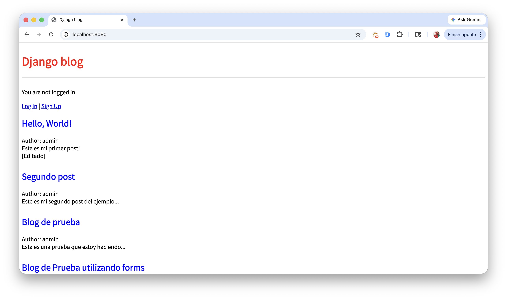

---

## Login Page

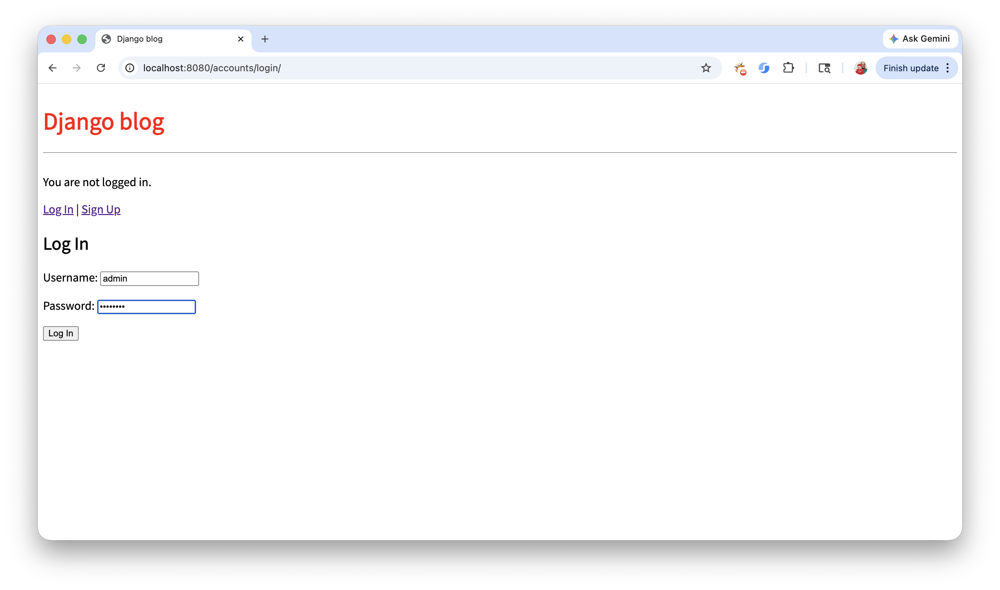

---

## Signup Page

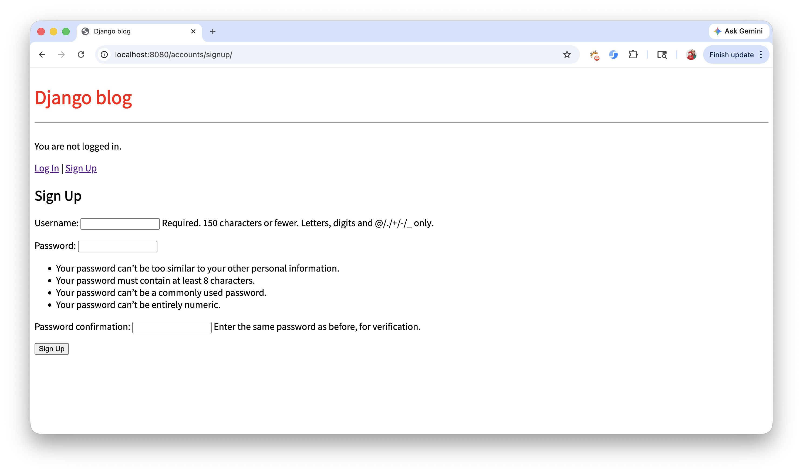

---

## New Post Page

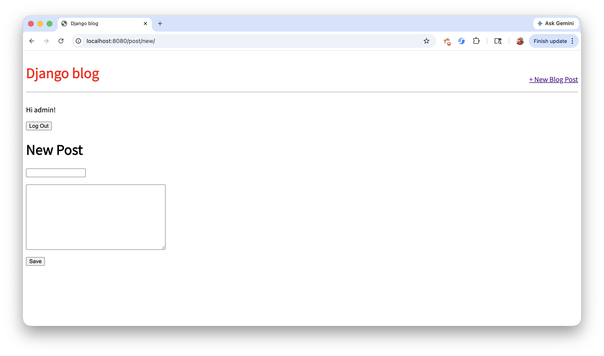

---

## New Post Page With Data

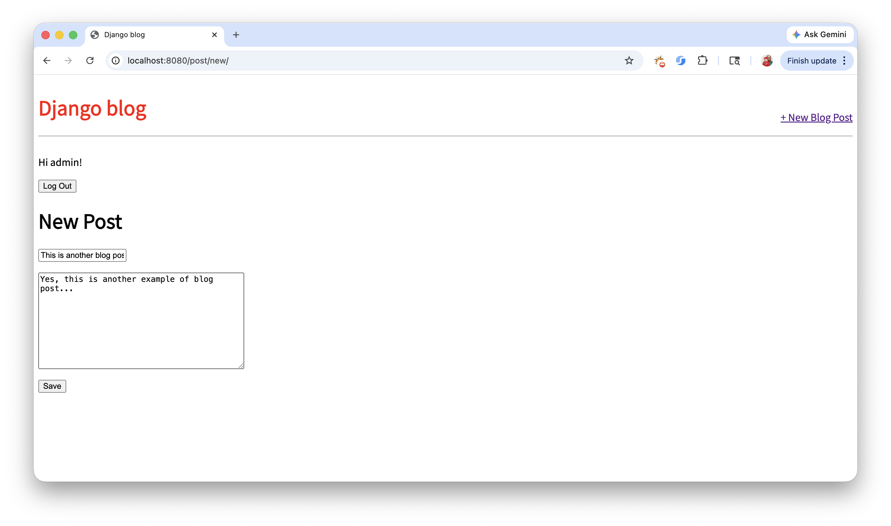

---

## Detail Post Page

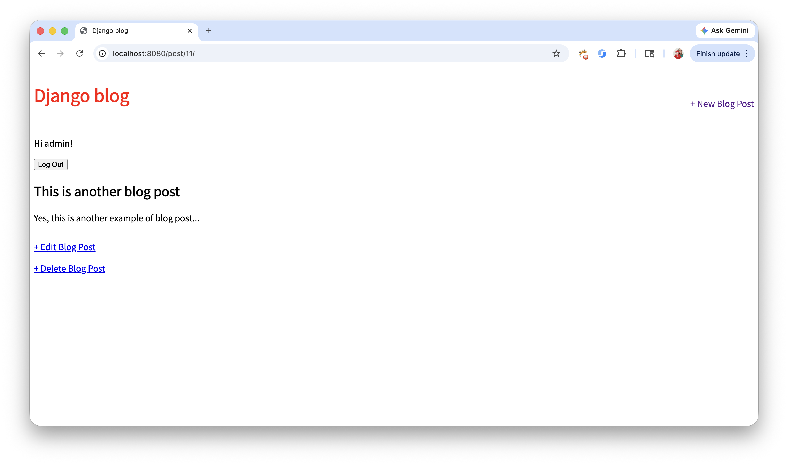

---

## Edit Post Page

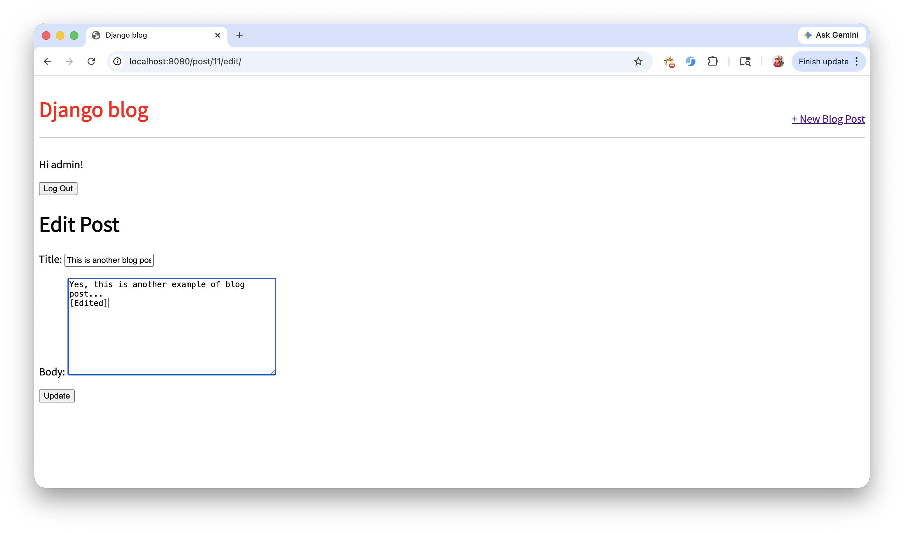

---

## Edit Post Page - User Not Logged In


---

## Edit Post Page - No Permission

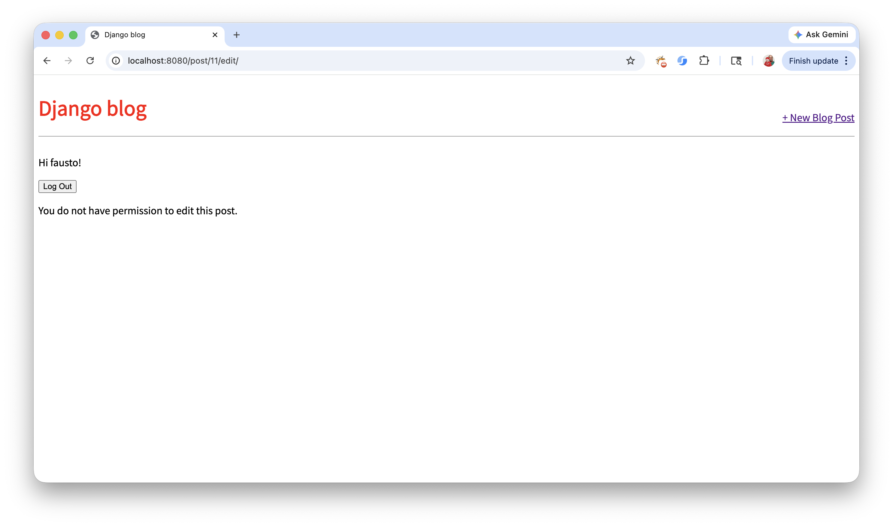

Please note that the user attempting to edit the post is not the original author of the post.

---

## Delete Post Page

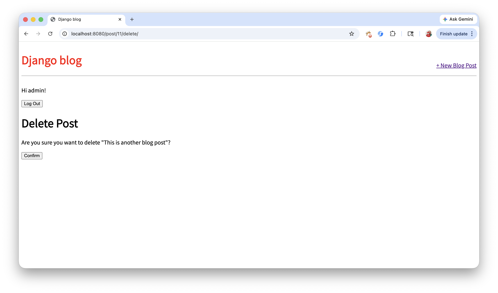

---

## Delete Post Page - User Not Logged In

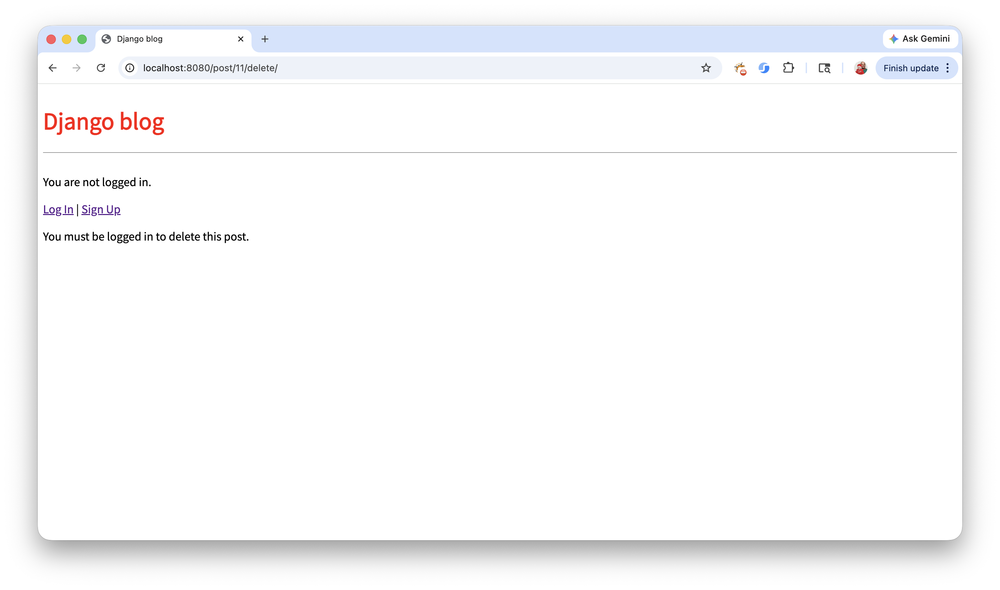

---

## Delete Post Page - No Permission

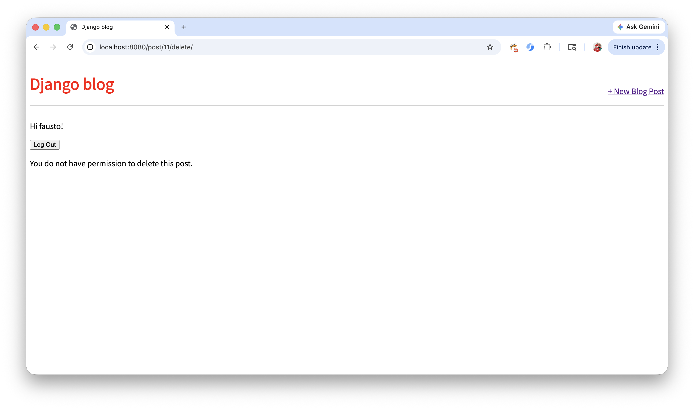

Please note that the user attempting to delete the post is not the original author of the post.

---

## Custom 404 Page

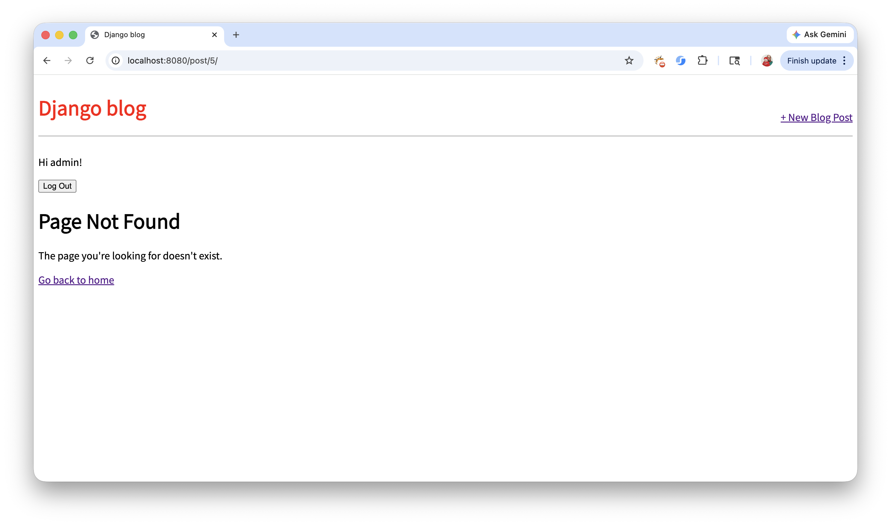

---

# Technologies Used

- Python
- Django
- HTML
- CSS
- SQLite

---

# Learning Objectives

This project helped reinforce knowledge in:

- Django authentication system
- User authorization and permissions
- CRUD application development
- Django generic views
- URL routing
- Templates inheritance
- Error handling
- Secure application logic

---

# Future Improvements

Potential future improvements may include:

- Comment system
- User profile pages
- Rich text editor
- Post categories and tags
- Search functionality
- Responsive UI improvements
- Deployment to a cloud platform

---

# Running the Django Project

## 1. Create and Activate a Virtual Environment

```bash
python3 -m venv .venv
```

Creates a Python virtual environment inside a folder named `.venv`.

---

## 2. Activate the Virtual Environment

### macOS / Linux

```bash
source .venv/bin/activate
```

Activates the virtual environment so all installed packages remain isolated from the global Python installation.

### Windows (PowerShell)

```powershell
.venv\Scripts\activate
```

---

## 3. Upgrade pip (Optional but Recommended)

```bash
pip install --upgrade pip
```

Updates `pip` to the latest version.

---

## 4. Install Project Dependencies

```bash
pip install -r requirements.txt
```

Installs all required Python packages listed in `requirements.txt`.

---

## 5. Apply Database Migrations

```bash
python3 manage.py migrate
```

Creates and updates the database tables required by Django.

> **Important:**  
> This command must be executed before creating the superuser because Django authentication tables need to exist first.

---

## 6. Create the Django Superuser

```bash
python3 manage.py createsuperuser
```

Creates an administrator account to access the Django admin panel.

You will be prompted to enter:

- Username
- Email address (optional)
- Password

---

## 7. Run the Development Server

```bash
python3 manage.py runserver
```

Starts the Django development server.

By default, the project will be available at:

```text
http://127.0.0.1:8000/
```

The Django admin panel will be available at:

```text
http://127.0.0.1:8000/admin/
```

---

# Author

Fausto Gonzalez

This project is part of my personal software development portfolio.